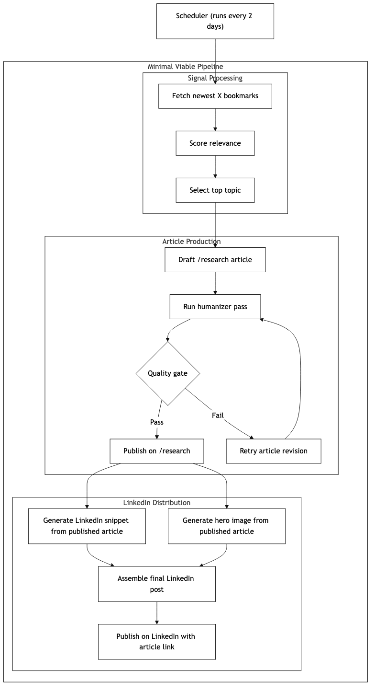

# Research Pipeline (CursorWorkshop)

This folder contains the production pipeline that turns fresh X bookmarks into:

1. A long-form `/research` article.
2. A style-locked hero image attached to that article.
3. A synchronized nightly rollout to:
   - `https://www.claudeworkshop.com/research`
   - `https://www.claudeworkshop.com/research`
   - `https://www.codexworkshop.com/research`
4. A Resend completion email to founders with source links + generation cost.

## Pipeline Diagram



Built with:

- Mermaid syntax compatible with [agents.craft.do/mermaid](https://agents.craft.do/mermaid)
- Visual conventions inspired by [beautiful-mermaid](https://github.com/lukilabs/beautiful-mermaid)
- Source diagram in [diagrams/mvp-research-pipeline.mmd](diagrams/mvp-research-pipeline.mmd)
- Monochrome style in [diagrams/mermaid-bw.css](diagrams/mermaid-bw.css)

Render command:

```bash
mmdc -i docs/nautilus/diagrams/mvp-research-pipeline.mmd \
  -o docs/nautilus/diagrams/mvp-research-pipeline.png \
  --cssFile docs/nautilus/diagrams/mermaid-bw.css \
  -b white -t neutral
```

## Structure

- `pipeline/` scripts
- `data/state/` persisted selection and publish state
- `data/live/` generated bookmark snapshots (ignored)
- `data/outbox/` generated per-run packages (ignored)
- `docs/` notes
- `diagrams/` architecture visuals

## Core Flow

Machine-readable workflow spec:

- `docs/nautilus/pipeline/research-full-run.workflow.yaml`

1. Fetch newest X bookmarks.
2. Score relevance for agentic coders.
3. Select next candidate.
4. Draft article -> humanizer pass -> quality gate retry loop.
5. Generate a custom hero image from finalized article scene brief(s) with style/composition QA + retry.
6. Hard gate: if custom hero image is missing, the package is rejected (no publish).
7. Apply package to `content/editorials` + `public/images/editorials`.
8. Commit + push changes to `cursorworkshop`.
9. Deploy `claudeworkshop.com`.
10. Sync the same publish package into `claudeworkshop` and `codexworkshop`.
11. Deploy both mirror sites.
12. Wait until `/research/<slug>` is live on all three sites.
13. Send Resend summary email with:

- X bookmark link used
- all live `/research/<slug>` URLs
- estimated API generation cost

## Local Run

```bash
# dry run
node pipeline/run-cycle.mjs --dry-run

# live run
OPENAI_API_KEY=... \
node pipeline/run-cycle.mjs \
  --apply-to-cursor \
  --cursor-repo /Users/rogiermuller/Developer/cursorworkshop
```

## Schedule

`research-cycle.yml` runs every night via GitHub Actions cron (`0 1 * * *`, UTC).

## Codex In CI

The `research-cycle` workflow includes a Codex pass (`openai/codex-action`) after generation and before commit.
It polishes newly generated `content/editorials/*.mdx` articles to improve tone and readability while preserving facts.

## Required GitHub Secrets

- `OPENAI_API_KEY` (required for article generation, image generation, and Codex polish)
- `X_AUTH_TOKEN` (required for headless X bookmarks fetch via Bird)
- `X_CT0` (required for headless X bookmarks fetch via Bird)
- `RESEND_API_KEY` (required for completion email)
- `BRAND_SYNC_TOKEN` (required to push nightly mirror updates)
- `VERCEL_TOKEN` (required for nightly source + mirror deploys)
- `VERCEL_ORG_ID` (required for nightly source + mirror deploys)
- `VERCEL_PROJECT_ID` (required for `cursorworkshop` source deploy)

Optional:

- `OPENAI_TEXT_MODEL`
- `OPENAI_IMAGE_MODEL`
- `OPENAI_TEXT_INPUT_USD_PER_1M` (default `2`)
- `OPENAI_TEXT_OUTPUT_USD_PER_1M` (default `8`)
- `OPENAI_IMAGE_1536X1024_USD_EACH` (default `0.063`)
- `RESEARCH_NOTIFY_EMAILS` (default: `contact@rogyr.com,vasilis@vasilistsolis.com`)
- `RESEARCH_NOTIFY_FROM` (default: `Claude Workshop <info@claudeworkshop.com>`)
- `RESEARCH_NOTIFY_REPLY_TO` (default: `info@claudeworkshop.com`)
- `RESEARCH_BASE_URL` (default in workflow: `https://www.claudeworkshop.com/research`)
- `RESEARCH_SITE_BASE_URLS` (default: all three production `/research` bases)

Content-shape tuning (dynamic):

- `NAUTILUS_MIN_WORD_COUNT` (default `450`)
- `NAUTILUS_MAX_WORD_COUNT` (default `1100`, ~5-6 minute read cap)
- `NAUTILUS_TARGET_WORD_COUNT` (default `900`)

Where article style is enforced:

- Generator prompt + quality gate: [pipeline/build-and-package-research.mjs](/Users/rogiermuller/Developer/nautilus/pipeline/build-and-package-research.mjs)
- CI polish prompt: [prompts/codex-polish.md](/Users/rogiermuller/Developer/nautilus/prompts/codex-polish.md)
- Machine-readable pipeline flow: [pipeline/research-full-run.workflow.yaml](/Users/rogiermuller/Developer/nautilus/pipeline/research-full-run.workflow.yaml)

Quick setup helper:

```bash
scripts/setup-github-secrets.sh cursorworkshop/claudeworkshop
```

## Required Vercel Environment Variables

- `CRON_SECRET` (used by Vercel Cron auth header)
- `GITHUB_ACTIONS_TRIGGER_TOKEN` (PAT with permission to dispatch workflows)

Optional overrides:

- `RESEARCH_GH_OWNER` (default: `cursorworkshop`)
- `RESEARCH_GH_REPO` (default: `cursorworkshop`)
- `RESEARCH_GH_WORKFLOW_ID` (default: `research-cycle.yml`)
- `RESEARCH_GH_REF` (default: `main`)

## Manual endpoint test

```bash
curl -i "https://www.claudeworkshop.com/api/automation/cron?token=$CRON_SECRET"
```

You should receive `202` with `status: queued` (or `status: skipped` if a run is already active).

Full setup guide:

- [docs/vercel-cron-setup.md](/Users/rogiermuller/Developer/cursorworkshop/docs/nautilus/docs/vercel-cron-setup.md)

## Image Style

Hero images are generated with a strict style template and article-grounded scene briefs.

- Single source of truth: [examples/image-style/style-template.json](/Users/rogiermuller/Developer/cursorworkshop/docs/nautilus/examples/image-style/style-template.json)
- Canonical reference image: [examples/image-style/target-style-reference.png](/Users/rogiermuller/Developer/cursorworkshop/docs/nautilus/examples/image-style/target-style-reference.png)
- Anti-trope guard: images should not all default to a person behind a computer; non-human artifact/workflow scenes are explicitly supported.
- Generation now evaluates style + composition, then runs diversity QA (for multi-variant runs) and retries only failing variants.

Reference assets:

- [examples/image-style/README.md](/Users/rogiermuller/Developer/cursorworkshop/docs/nautilus/examples/image-style/README.md)
- [examples/image-style/prompt-template.md](/Users/rogiermuller/Developer/cursorworkshop/docs/nautilus/examples/image-style/prompt-template.md)
- [examples/image-style/reference-style-spec.md](/Users/rogiermuller/Developer/cursorworkshop/docs/nautilus/examples/image-style/reference-style-spec.md)

Import your exact reference image:

```bash
docs/nautilus/scripts/set-image-style-reference.sh /absolute/path/to/reference.png
```

Style QA tuning:

- `NAUTILUS_IMAGE_MAX_ATTEMPTS` (default `8`)
- `NAUTILUS_IMAGE_MIN_SCORE` (default `96`)
- `NAUTILUS_IMAGE_COMPOSITION_MIN_SCORE` (default `94`)
- `OPENAI_IMAGE_REVIEW_MODEL` (default `gpt-4.1-mini`)

Candidate generation flags:

- `--style-template <path>`
- `--subject-scale 0.28`
- `--negative-space 0.55`
- `--diversity-min 0.70`

Candidate run outputs now include:

- `style_score`
- `composition_score`
- `diversity_score_vs_others`
- `scene_brief`
