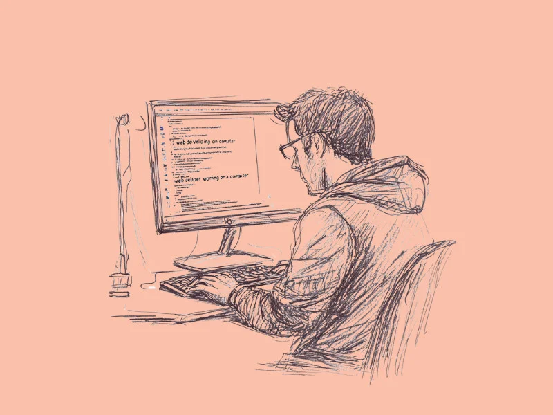

# Image Style Example

This folder stores reference visuals for research hero images.

## Target Style

- Hand-drawn pen/pencil sketch illustration
- Exactly one focal technical subject/object (human optional)
- Soft two-color gradient background
- No readable text/labels, no logos, no watermarks
- Editorial and credible (not meme-like)
- Do not default to person-at-computer compositions
- Encourage abstract, high-level conceptual scenes
- No multi-character compositions

## Files

- `target-style-reference.png`: drop the exact reference image here.
- `prompt-template.md`: canonical prompt style used by the generator.
- `reference-style-spec.md`: detailed SSOT description of the reference style fingerprint.
- `reference-style-spec.md` is intentionally strict and exhaustive; image QA retries until this fingerprint is met.

## Active Reference



When `target-style-reference.png` is present, the generator runs iterative style QA against it and retries until score passes threshold.

## Quick Import

```bash
docs/nautilus/scripts/set-image-style-reference.sh /absolute/path/to/your-reference.png
```

## Tuning Knobs

- `NAUTILUS_IMAGE_MAX_ATTEMPTS` (default `8`)
- `NAUTILUS_IMAGE_MIN_SCORE` (default `96`)
- `OPENAI_IMAGE_REVIEW_MODEL` (default `gpt-4.1-mini`)
